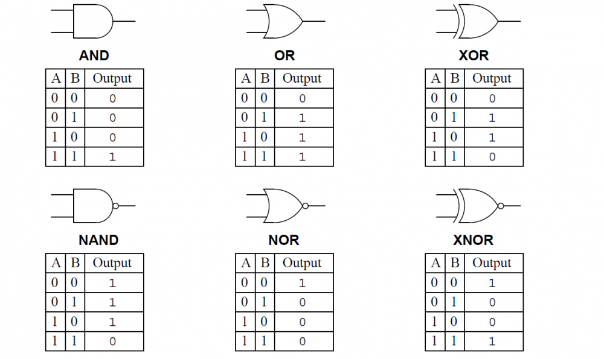

# voyage-project-tier2-boolebots

## Table of Contents

* [Overview](#overview)
* [General Instructions](#general-instructions)
* [Requirements & Specifications](#requirements-specifications)
* [Acknowledgements](#acknowledgements)
* [About Chingu](#about-chingu)

## Overview

Boole Bots is a game that is not only fun, but also an aid in helping to 
understand basic Boolean logic. This game has an arena of 8x8 game tiles in
which your bots move at random speeds and trajectories. The Bots are assigned
boolean values of 0 or 1 and boolean operations - AND, OR, NOR, NOT. 

When a bot collides with another bot its boolean operation is applied to both
it and the other bots' boolean value to determine which one wins or looses, or
if the collision results in a tie. Loosing bots disappear and winning bots 
continue moving about the arena until only one remains.

## General Instructions

This project is designed to be worked on by a team rather than an individual
Chingu. This means you and your team will need to thoroughly read and
understand the requirements and specifications below, **_and_** define and
manage your project following the _Agile Methodology_ defined in the
[Voyage Handbook](https://chingucohorts.notion.site/Voyage-Guide-1e528dcbf1d241c9a93b4627f6f1c809).

As you create this project make sure it meets all of the requirements, but once
it reaches MVP start implementing the optional features or get creative and
extend it in ways we haven't envisioned. In other words, use the power of
teamwork to make it distinctive and unique.

Take note that we haven't given specific direction on what your UI/UX should
look like. This is another area where you and your team can put your creativity 
to work! 

## Requirements & Specifications

### What You Need to Do

#### Structure

- [ ] This is a purely frontend application. No backend is required. 
- [ ] You may use any languages, tools, or libraries you prefer when designing and building this app. 
- [ ] You may **_NOT_** use AI-base solution generators like GitHub Copilot.
- [ ] Useful links and resources
    - [George Boole (Wikipedia)](https://en.wikipedia.org/wiki/George_Boole)
    - [Boolean Algebra (Wikipedia)](https://en.wikipedia.org/wiki/Boolean_algebra)
    - [Video Game Physics Tutorial - Part I: An Introduction to Rigid Body Dynamics](https://www.toptal.com/game/video-game-physics-part-i-an-introduction-to-rigid-body-dynamics)

#### Styling

- [ ] Surprise us!!!
- [ ] Add a footer containing a link to your teams GitHub repo
- [ ] In general, you will find these [UI design principles](https://www.justinmind.com/ui-design/principles) helpful.
- [ ] Recommend using this resource for [clean CSS](https://www.devbridge.com/articles/implementing-clean-css-bem-method/)

#### Functionality

-   User can see the game window with these components
    - Game configuration panel
    - Leaderboard showing bots ranked by their scores
    - Game controls
    - Arena of 8x8 game tiles where the bots battle

- Game Configuration Panel
    -   [ ] User can see a game configuration panel with these subcomponents:
        - Four bot panels with controls to allow the user to input a unique bot 
        name, select its Boolean value and operation, select the bots speed using a 
        slider, and a dropdown to specify its starting direction - North, South, 
        East, West
    -   [ ] User can enter a unique name for each bot into an input text box
    -   [ ] User can see an error message if the name entered is the same name
    assigned to another bot.
    -   [ ] User can select the Boolean value (0 or 1) from a dropdown for **_each_** bot.
    -   [ ] User can select 2 bots to compete in the arena.
    -   [ ] User can select the Boolean operation from a dropdown - AND, OR, XOR,
    or NOT that will be applied to **_all_** bots.
    -   [ ] User can move the speed slider to set the speed for all bots. This is the interval at which all bots move to the next adjacent cell in the grid.
    -   [ ] User can select a bots starting direction from the direction dropdown.
    -   [ ] User can see the bot randomly assigned to a tile in the arena once its
    name has been defined.

- Game Controls
    -   [ ] User can a button in the game control panel to 'Battle!'
    -   [ ] User can click the 'Battle!' button to start the bot battle in the arena. The two bots should be randomly placed in cells in the arena, which at least one empty cell between them.
    -   [ ] User can see bots move based on the speed and direction assigned to them.
    -   [ ] User can see the 'Battle!' button text change to 'Stop!' once a battle
    is started.
    -   [ ] User can click the 'Stop!' button to halt gameplay
    -   [ ] User can see the 'Stop!' button text change back to 'Battle!' once a
    single bot wins the match.

- Arena
    -   [ ] User can see bots bounce off the boundary walls of the arena in a new
    direction. The new direction may be random.
    -   [ ] User can see bots pause for an instant when they collide.
    -   [ ] User can see a bot disappear after colliding with another if the result of the 
    boolean operation applied to its boolean value and that of the other bot results in a loss. Determining the order of 'bot movement (eg. which moves first) is left up to your
    algorithm.

            | Oper | Bot 1 | Bot 2 | Result | Outcome                |
            |------|-------|-------|--------|------------------------|
            | AND  |   0   |   0   |   0    | Tie                    |
            | AND  |   0   |   1   |   0    | Tie                    |
            | AND  |   1   |   0   |   0    | Tie                    |
            | AND  |   1   |   1   |   1    | First bot to move wins |
            | OR   |   0   |   0   |   0    | Tie                    |
            | OR   |   0   |   1   |   1    | First bot to move wins |
            | OR   |   1   |   0   |   1    | First bot to move wins |
            | OR   |   1   |   1   |   1    | First bot to move wins |
            | XOR  |   0   |   0   |   0    | Tie                    |
            | XOR  |   0   |   1   |   1    | First bot to move wins |
            | XOR  |   1   |   0   |   1    | First bot to move wins |
            | XOR  |   1   |   1   |   0    | Tie                    |
            | NOR  |   0   |   0   |   1    | First bot to move wins |
            | NOR  |   0   |   1   |   0    | Tie                    |
            | NOR  |   1   |   0   |   0    | Tie                    |
            | NOR  |   1   |   1   |   0    | Tie                    |

    -   [ ] User can see a bot that wins a collision resume its path at the same 
    speed and direction.
    -   [ ] User can see both colliding bots resume their paths at the same speed
    and direction in the event of a tie. 
    -   [ ] User can see gameplay stop when only one bot remains.

- Leaderboard
    -   [ ] User can see the display of wins and losses for each bot on the
    leaderboard
    -   [ ] User can see the tally of wins incremented for bots winning a collision.
    -   [ ] User can see the tally of losses decremented for bots losing a collision.

### Extras (Not Required)

-   [ ] User can see a log panel displaying the details of game milestones.
Hint: This may be useful to the Developer during development and debugging.
-   [ ] User can see a game clock displaying current elapsed game time that is
updated every second.
-   [ ] User may choose a bots starting direction as North, Northeast, Southeast,
South, Southwest, West, or Northwest.
-   [ ] User may specify the dimensions of the arena.
-   [ ] User may select an unique icon for a bot from a palette of icons. Icons
in the palette are disabled once they are assigned.
-   [ ] User can see the bot with the most wins highlighted in some way in the
Leaderboard.

## About Chingu

If you aren’t yet a member of Chingu we invite you to join us. We help our 
members transform what they’ve learned in courses & tutorials into the 
practical experience employers need and want.

## Acknowledgements

Thanks to our friend [Florin Pop](https://twitter.com/florinpop1705) who 
contributed the initial version on his [App Ideas repo](https://github.com/florinpop17/app-ideas). 